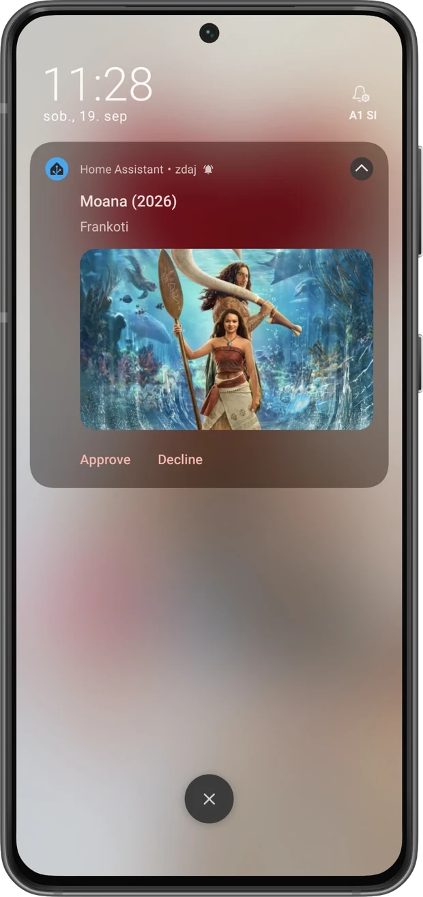
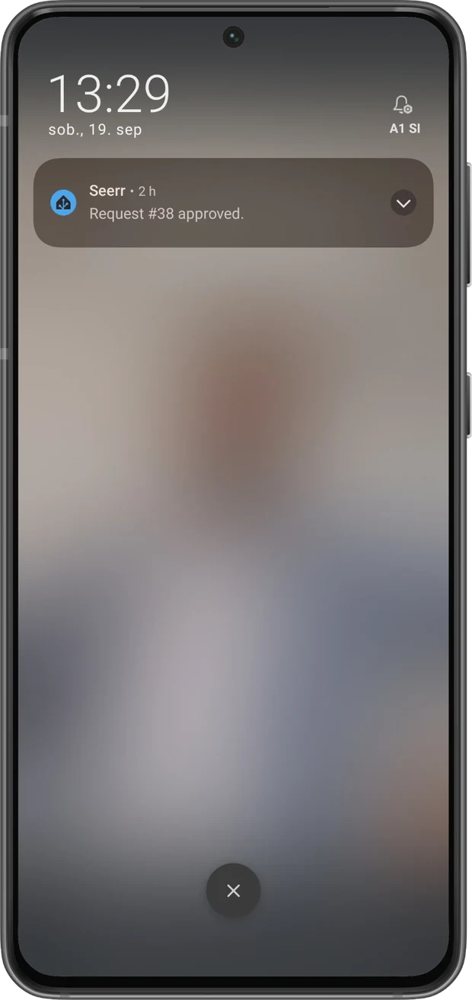

<picture>
  <source media="(prefers-color-scheme: dark)" srcset="docs/images/logo-wide-dark.png">
  
</picture>

### Approve or decline Seerr requests straight from a mobile notification.

[![Home Assistant][ha-badge]][ha-url]
[![Blueprint][blueprint-badge]][blueprint-url]
[![License][license-badge]](LICENSE)

Works with Overseerr and Jellyseerr, through Home Assistant's official `overseerr` integration.

[![Import the blueprint into Home Assistant][import-badge]][import-url]

[Setup](docs/setup.md) &middot; [Troubleshooting](docs/troubleshooting.md) &middot; [Examples](examples/README.md) &middot; [Event reference](docs/event-reference.md)

---

Someone asks for a film. Your phone buzzes — poster, title, who asked, and for TV
the seasons they picked — with Approve and Decline on the lock screen. Press one
and it is done.

I wrote this because Home Assistant's Seerr integration cannot approve anything.
It ships `get_requests`, `request_media` and `search_media`, and that is the lot.
Requests arrive, and then you go and open the web UI anyway. So the integration
handles the incoming side, and a `rest_command` sends the decision back.

No custom component, no HACS: a blueprint and one REST command file.

> Older guides reach for `overseerr.update_request`. That belonged to the
> `vaparr/ha-overseerr` custom component, not to the official integration, and it
> is gone. [Setup](docs/setup.md) covers what replaced it.

## Features

- 📲 Poster, title, requester, and the seasons they asked for
- ✅ Approve or Decline without unlocking the phone
- 🧩 A blueprint with a device picker — no YAML to edit
- 📦 Or one package file, if you prefer YAML to blueprints
- 🚦 A failed decision keeps the prompt on screen and shows you the HTTP status
- 🤖 An [`llms.txt`](llms.txt), so ChatGPT stops inventing `overseerr.update_request`

## Requirements

| Requirement | Why |
|---|---|
| Home Assistant 2024.12+ | The `overseerr` integration, and the `triggers:` / `actions:` syntax |
| The official [Seerr integration](https://www.home-assistant.io/integrations/overseerr/) | Registers the webhook and creates the `..._last_media_event` entity |
| A Seerr API key | Seerr → Settings → General → API Key |
| The Companion app | Images and action buttons need it |
| CSRF Protection off in Seerr | See below |

About that CSRF setting: Seerr blocks its own API from writing the webhook config
while CSRF Protection is on, so Home Assistant cannot register itself and no
events ever arrive. It is a documented requirement of the official integration,
not something SeerrHA adds. It applies to a service you are presumably exposing
only to your own network — and if your Seerr is reachable from the internet, the
thing protecting it should be a reverse proxy with authentication, not that
setting.

## Install

The [Setup Guide](docs/setup.md) has the long version, with verification steps.

1. Add the Seerr integration: Settings → Devices & Services → Add Integration →
   Seerr, with your server URL and API key.
2. Copy [`examples/rest_commands.yaml`](examples/rest_commands.yaml) into your
   config unchanged, include it with `rest_command: !include rest_commands.yaml`,
   and restart once.
3. Import the blueprint, pick your phone from the list, paste your Seerr URL and
   API key.

[![Import the blueprint into Home Assistant][import-badge]][import-url]

That first restart is genuinely required: `rest_command` is not loaded until the
key exists, so there is nothing to reload yet. Afterwards `rest_command.reload`
is enough. Command names must also be lowercase slugs — a capital letter kills
the whole block while the previous definitions stay in memory, which fails in a
very confusing way.

Prefer a single file? Drop [`packages/seerrha.yaml`](packages/seerrha.yaml) into
`config/packages/` instead, and edit the three values at the top of it.

## Where your API key lives

The blueprint takes the key as an input, and that is what removes the YAML
editing. Inputs are stored as plain text in `automations.yaml` and show up in
automation traces, so the key travels into backups and diagnostics downloads.

That is the trade, and you can decline it. Set the `X-Api-Key` header in your
`rest_commands.yaml` to `!secret seerr_api_key`, put the key in `secrets.yaml`,
and leave the blueprint field blank — the command reads the secret and ignores
whatever the blueprint passes.

Either way it is a credential: anyone holding it can approve requests on your
Seerr.

## What you get back

A short confirmation once Seerr accepts the decision, and the original prompt
clears itself.

If the POST fails — wrong key, CSRF switched back on — the prompt is left alone
and you get the HTTP status instead. `rest_command` only logs a warning on a
4xx, so without checking the response a failed approve would look exactly like a
successful one, while the request sat untouched in Seerr.

 

## Documentation

| Guide | What is in it |
|---|---|
| [Setup Guide](docs/setup.md) | The walkthrough, every blueprint input, and how to verify each step |
| [Event & Data Reference](docs/event-reference.md) | Attribute structure, event types, API endpoints, and the design decisions |
| [Troubleshooting & FAQ](docs/troubleshooting.md) | Slug errors, stale REST commands, 403 hunts, notify entity vs. action |
| [Examples & Cookbook](examples/README.md) | Ready-to-use automations and a helper script |
| [`llms.txt`](llms.txt) | Compact reference for feeding to an AI assistant |

## Support

- [Report an issue](https://github.com/vednolacni/SeerrHA/issues)
- [Seerr integration — Home Assistant docs](https://www.home-assistant.io/integrations/overseerr/)
- [`rest_command` — Home Assistant docs](https://www.home-assistant.io/integrations/rest_command)
- [Seerr webhook payload](https://docs.seerr.dev/using-seerr/notifications/webhook/)

## Credits

SeerrHA started from [vaparr/ha-overseerr](https://github.com/vaparr/ha-overseerr)
and its *Phone Notifications in Home Assistant* wiki page, the first public recipe
for approving Overseerr requests from a notification. That project is a HACS
custom component, and its `overseerr.update_request` service no longer applies now
that Home Assistant ships an official integration on the same domain. This is the
same idea rebuilt on top of it — [what changed, and
why](docs/event-reference.md#design-decisions).

Documentation layout inspired by [JellyHA](https://github.com/zupancicmarko/jellyha).
If you run Jellyfin, go and look at it properly: it covers far more ground than
this does.

Developed with the assistance of AI.

## License

MIT

Personal use only. SeerrHA is configuration glue between your own Home Assistant
and your own Seerr server. It does not provide, facilitate or encourage
unauthorized content, and you are responsible for the legality of what you host.

[ha-badge]: https://img.shields.io/badge/Home%20Assistant-2024.12%2B-41BDF5.svg
[ha-url]: https://www.home-assistant.io/integrations/overseerr/
[blueprint-badge]: https://img.shields.io/badge/Blueprint-Automation-03a9f4.svg
[blueprint-url]: blueprints/automation/seerrha/seerr_request_approval.yaml
[license-badge]: https://img.shields.io/badge/License-MIT-green.svg
[import-badge]: https://my.home-assistant.io/badges/blueprint_import.svg
[import-url]: https://my.home-assistant.io/redirect/blueprint_import/?blueprint_url=https%3A%2F%2Fgithub.com%2Fvednolacni%2FSeerrHA%2Fblob%2Fmain%2Fblueprints%2Fautomation%2Fseerrha%2Fseerr_request_approval.yaml
