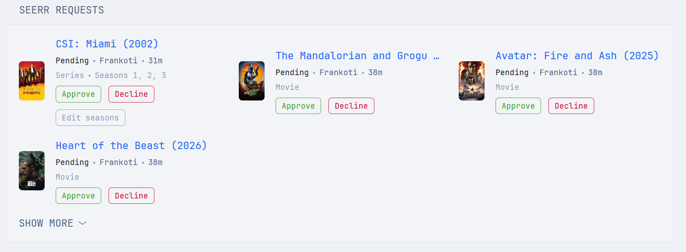
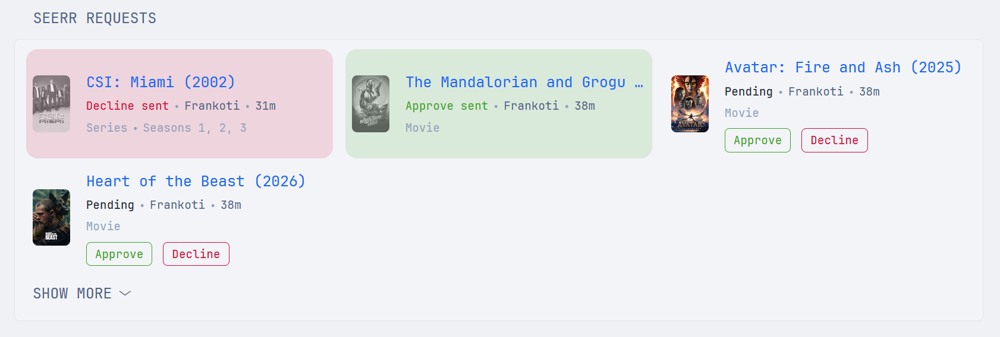
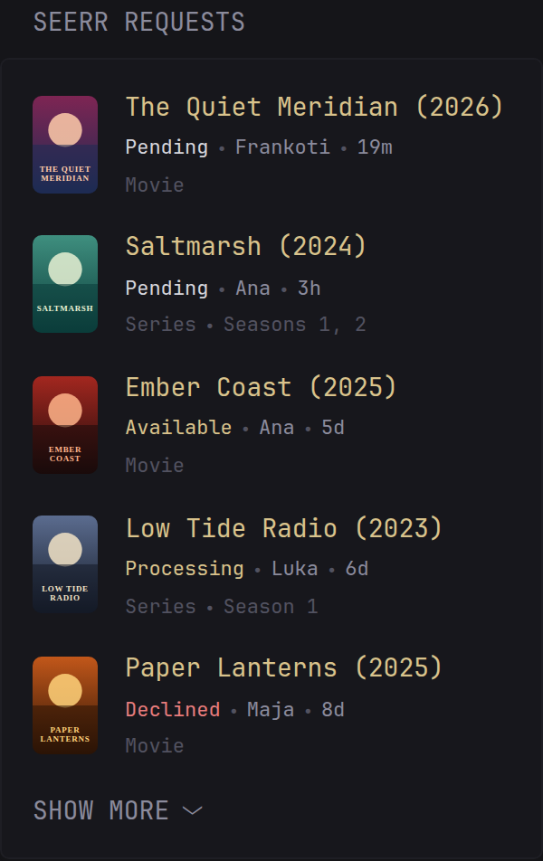
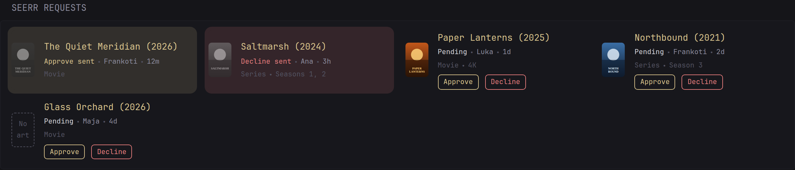

# Seerr Requests

The requests waiting in Seerr (or Overseerr, or Jellyseerr): poster, title,
who asked and when, and for TV the seasons they picked. Each one links to its
page in Seerr, where approving is a click away.

It fits the column it is in: one request per row in a small column, as many
side by side as fit in a wide one.

If you run Home Assistant, the widget can also carry Approve and Decline
buttons of its own. They are off by default; [see below](#approve-and-decline-buttons).



## Environment variables

- `SEERR_URL`: the address Glance uses to reach Seerr, e.g.
  `http://192.168.1.10:5055` or `http://seerr:5055` inside Docker.
- `SEERR_API_KEY`: Seerr → Settings → General → API Key.

The widget only reads from Seerr, so Seerr's CSRF Protection setting does not
affect it.

## Options

| Option | Default | What it does |
|---|---|---|
| `seerr-url` | | Where Glance fetches from. Set from `SEERR_URL`. |
| `api-key` | | Set from `SEERR_API_KEY`. |
| `link-url` | `seerr-url` | Where your browser reaches Seerr, if that differs from `seerr-url` (a Docker hostname, say). Used for the title and poster links. |
| `filter` | `pending` | `pending`, `all`, `approved`, `processing`, `available`, `unavailable` or `failed`. |
| `sort` | `added` | `added` or `modified`. |
| `max-requests` | `10` | How many requests to show. Each one costs one extra API call per refresh, for its title and poster. |
| `collapse-after` | `4` | Requests shown before "Show more". In a wide column, a multiple of how many fit side by side keeps the last row full. |
| `show-posters` | `true` | Set to `false` for a text-only list. |
| `ha-webhook-url` | `""` | Turns on the Approve and Decline buttons. See below. |

`title-url` opens the pending tab of Seerr's request list at `SEERR_URL`. It is
plain Glance config, not part of the template, so if you set `link-url` or
change `filter`, edit it to match.

## Widget YAML

Paste this under a column's `widgets:`, or save it as `seerr-requests.yml` and
use `- $include: seerr-requests.yml`.

```yaml
- type: custom-api
  title: Seerr Requests
  title-url: ${SEERR_URL}/requests?filter=pending
  cache: 5m
  options:
    seerr-url: ${SEERR_URL}
    api-key: ${SEERR_API_KEY}
    # link-url: https://seerr.example.com   # where browsers reach Seerr, if not seerr-url
    filter: pending       # pending | all | approved | processing | available | unavailable | failed
    sort: added           # added | modified
    max-requests: 10
    collapse-after: 4
    show-posters: true
    ha-webhook-url: ""    # set to enable Approve / Decline, see README
  template: |
    {{ $baseUrl := .Options.StringOr "seerr-url" "" | trimSuffix "/" }}
    {{ $apiKey := .Options.StringOr "api-key" "" }}
    {{ $linkUrl := .Options.StringOr "link-url" $baseUrl | trimSuffix "/" }}
    {{ $filter := .Options.StringOr "filter" "pending" }}
    {{ $sort := .Options.StringOr "sort" "added" }}
    {{ $max := .Options.IntOr "max-requests" 10 }}
    {{ $collapseAfter := .Options.IntOr "collapse-after" 4 }}
    {{ $showPosters := .Options.BoolOr "show-posters" true }}
    {{ $webhook := .Options.StringOr "ha-webhook-url" "" }}

    {{ $list := newRequest (concat $baseUrl "/api/v1/request")
      | withParameter "take" (printf "%d" $max)
      | withParameter "filter" $filter
      | withParameter "sort" $sort
      | withHeader "Accept" "application/json"
      | withHeader "X-Api-Key" $apiKey
      | getResponse }}

    {{ if ne $list.Response.StatusCode 200 }}
      <div class="text-center">
        <p class="color-negative">Could not load requests (HTTP {{ $list.Response.StatusCode }})</p>
        <p class="size-h6 color-subdue margin-top-3">
          {{ if eq $list.Response.StatusCode 403 }}Check SEERR_API_KEY.{{ else }}Check SEERR_URL and that Seerr is reachable from Glance.{{ end }}
        </p>
      </div>
    {{ else }}
      {{ $requests := $list.JSON.Array "results" }}
      {{ if eq (len $requests) 0 }}
        <p class="text-center color-subdue">No {{ if ne $filter "all" }}{{ $filter }} {{ end }}requests</p>
      {{ else }}
        {{ if ne $webhook "" }}<iframe name="sink-seerr-requests" title="Fallback target for the Approve and Decline buttons" hidden></iframe>{{ end }}
        <ul class="list collapsible-container" data-collapse-after="{{ $collapseAfter }}"
          style="display: grid; grid-template-columns: repeat(auto-fill, minmax(min(100%, 24rem), 1fr)); gap: 1.6rem 2.4rem;">
        {{ range $requests }}
          {{ $type := .String "type" }}
          {{ $tmdbId := .String "media.tmdbId" }}
          {{ $is4k := .Bool "is4k" }}
          {{ $link := concat $linkUrl "/" $type "/" $tmdbId }}

          {{ $details := newRequest (concat $baseUrl "/api/v1/" $type "/" $tmdbId)
            | withHeader "Accept" "application/json"
            | withHeader "X-Api-Key" $apiKey
            | getResponse }}

          {{ $title := concat "TMDB " $tmdbId }}
          {{ $year := "" }}
          {{ $poster := "" }}
          {{ if eq $details.Response.StatusCode 200 }}
            {{ if eq $type "movie" }}
              {{ $title = $details.JSON.String "title" }}
              {{ $year = findMatch "^[0-9]{4}" ($details.JSON.String "releaseDate") }}
            {{ else }}
              {{ $title = $details.JSON.String "name" }}
              {{ $year = findMatch "^[0-9]{4}" ($details.JSON.String "firstAirDate") }}
            {{ end }}
            {{ $poster = $details.JSON.String "posterPath" }}
          {{ end }}

          {{ $who := .String "requestedBy.displayName" }}
          {{ if eq $who "" }}{{ $who = .String "requestedBy.username" }}{{ end }}
          {{ if eq $who "" }}{{ $who = .String "requestedBy.email" }}{{ end }}

          {{ $requestStatus := .Int "status" }}
          {{ $mediaStatus := .Int "media.status" }}
          {{ if $is4k }}{{ $mediaStatus = .Int "media.status4k" }}{{ end }}
          {{ $statusLabel := "Approved" }}
          {{ $statusClass := "color-primary" }}
          {{ if eq $requestStatus 1 }}{{ $statusLabel = "Pending" }}{{ $statusClass = "color-highlight" }}
          {{ else if eq $requestStatus 3 }}{{ $statusLabel = "Declined" }}{{ $statusClass = "color-negative" }}
          {{ else if eq $requestStatus 4 }}{{ $statusLabel = "Failed" }}{{ $statusClass = "color-negative" }}
          {{ else if eq $mediaStatus 5 }}{{ $statusLabel = "Available" }}{{ $statusClass = "color-positive" }}
          {{ else if eq $mediaStatus 4 }}{{ $statusLabel = "Partial" }}{{ $statusClass = "color-positive" }}
          {{ else if eq $mediaStatus 3 }}{{ $statusLabel = "Processing" }}{{ $statusClass = "color-primary" }}
          {{ end }}

          <li class="flex items-center gap-15" style="margin-top: 0;" data-seerrha-id="{{ .Int "id" }}">
            {{ if $showPosters }}
              <a href="{{ $link }}" target="_blank" rel="noreferrer" class="shrink-0">
                {{ if ne $poster "" }}
                  
                {{ else }}
                  <div class="color-subdue size-h6 text-center"
                    style="display: flex; align-items: center; justify-content: center; width: 3.6rem; aspect-ratio: 2 / 3; border: 1px dashed currentColor; border-radius: var(--border-radius);">No art</div>
                {{ end }}
              </a>
            {{ end }}
            <div class="flex-1 min-width-0">
              <a href="{{ $link }}" target="_blank" rel="noreferrer"
                class="size-h4 block text-truncate color-primary" title="{{ $title }}">{{ $title }}{{ if ne $year "" }} ({{ $year }}){{ end }}</a>
              <ul class="list-horizontal-text size-h6 margin-top-3">
                <li class="{{ $statusClass }}" data-seerrha-status>{{ $statusLabel }}</li>
                <li>{{ $who }}</li>
                <li {{ .String "createdAt" | parseTime "rfc3339" | toRelativeTime }}></li>
              </ul>
              <ul class="list-horizontal-text size-h6 color-subdue margin-top-3">
                <li>{{ if eq $type "movie" }}Movie{{ else }}Series{{ end }}</li>
                {{ if eq $type "tv" }}
                  {{ $seasons := .Array "seasons" }}
                  {{ if gt (len $seasons) 0 }}
                    <li class="text-truncate">{{ if eq (len $seasons) 1 }}Season{{ else }}Seasons{{ end }} {{ range $i, $s := $seasons }}{{ if $i }}, {{ end }}{{ $s.Int "seasonNumber" }}{{ end }}</li>
                  {{ end }}
                {{ end }}
                {{ if $is4k }}<li>4K</li>{{ end }}
              </ul>
              {{ if eq $requestStatus 1 }}
                {{ if ne $webhook "" }}
                   600000) return;
                        cmd = saved.cmd;
                      }
                      var tone = cmd === 'approve' ? 'positive' : 'negative';
                      var tint = 'color-mix(in srgb, var(--color-' + tone + ') 14%, transparent)';
                      row.style.background = tint;
                      row.style.boxShadow = '0 0 0 0.6rem ' + tint;
                      row.style.borderRadius = 'var(--border-radius)';
                      row.querySelectorAll('img').forEach(function (img) { img.style.filter = 'grayscale(1)'; img.style.opacity = '0.6'; });
                      var status = row.querySelector('[data-seerrha-status]');
                      status.textContent = cmd === 'approve' ? 'Approve sent' : 'Decline sent';
                      status.className = 'color-' + tone;
                      row.querySelector('[data-seerrha-actions]').style.display = 'none';">
                {{ end }}
                {{ if or (ne $webhook "") (eq $type "tv") }}
                  <div class="flex items-center gap-10 margin-top-5" style="flex-wrap: wrap;" data-seerrha-actions>
                    {{ if ne $webhook "" }}
                    <form method="post" action="{{ $webhook }}" target="sink-seerr-requests" class="flex gap-10"
                      onsubmit="var form = this, row = form.closest('li'), cmd = event.submitter.value;
                        var status = row.querySelector('[data-seerrha-status]'), mark = row.querySelector('[data-seerrha-mark]');
                        var buttons = form.querySelectorAll('button');
                        var body = new URLSearchParams(new FormData(form));
                        body.set('cmd', cmd);
                        buttons.forEach(function (b) { b.disabled = true; });
                        status.textContent = 'Sending';
                        fetch(form.action, { method: 'POST', mode: 'no-cors', body: body })
                          .then(function () {
                            try { localStorage.setItem('seerrha-' + row.dataset.seerrhaId, JSON.stringify({ cmd: cmd, t: Date.now() })); } catch (e) {}
                            mark.dataset.cmd = cmd;
                            mark.onload();
                          })
                          .catch(function () {
                            buttons.forEach(function (b) { b.disabled = false; });
                            status.textContent = 'Home Assistant unreachable';
                            status.className = 'color-negative';
                          });
                        return false;">
                      <input type="hidden" name="request_id" value="{{ .Int "id" }}">
                      <button type="submit" name="cmd" value="approve" class="size-h6 color-positive"
                        style="background: none; border: 1px solid currentColor; border-radius: var(--border-radius); padding: 0.2rem 0.8rem; cursor: pointer; font-family: inherit; white-space: nowrap;">Approve</button>
                      <button type="submit" name="cmd" value="decline" class="size-h6 color-negative"
                        style="background: none; border: 1px solid currentColor; border-radius: var(--border-radius); padding: 0.2rem 0.8rem; cursor: pointer; font-family: inherit; white-space: nowrap;">Decline</button>
                    </form>
                    {{ end }}
                    {{ if eq $type "tv" }}
                      <a href="{{ $link }}?manage=1" target="_blank" rel="noreferrer" class="size-h6 color-subdue"
                        title="Opens the series in Seerr with its requests listed; the pencil there edits the seasons"
                        style="background: none; border: 1px solid currentColor; border-radius: var(--border-radius); padding: 0.2rem 0.8rem; cursor: pointer; font-family: inherit; text-decoration: none; white-space: nowrap;">Edit seasons</a>
                    {{ end }}
                  </div>
                {{ end }}
              {{ end }}
            </div>
          </li>
        {{ end }}
        </ul>
      {{ end }}
    {{ end }}
```

## Gallery

After Approve on one request and Decline on another. Each row keeps the colour
of the button until the widget refreshes:



The default dark theme, with `filter: all` in a small column, showing the status
of each request:



The dark theme at full width:



## Series and seasons

Seerr approves and declines a request as a whole: Approve on a request for
seasons 1 to 3 approves all three. To approve only some of them, edit the
request first.

Every pending TV request in the widget has an Edit seasons link for that. It
opens the series in Seerr with its Manage panel already open (`?manage=1`),
where the pencil next to the request lets you untick seasons. Approve there or
in the widget afterwards. The link is there with or without the buttons, and
Seerr only shows the pencil to accounts allowed to manage requests.

## Approve and Decline buttons

Glance cannot approve on its own. Its templates run on the Glance server every
time the widget refreshes, so a write call inside one would fire on every
refresh. And calling Seerr from the browser would mean putting the API key in
the page, for anyone who opens it.

So the buttons post to a Home Assistant webhook, and Home Assistant makes the
call with the key it already holds:

```
button in Glance ──POST──▶ Home Assistant webhook ──▶ rest_command ──▶ Seerr
```

The Home Assistant side comes from
[SeerrHA](https://github.com/vednolacni/SeerrHA), which also turns new
requests into phone notifications with the same two buttons.

1. Add `rest_command.seerrha_request_action` to Home Assistant: copy
   [`rest_commands.yaml`](https://github.com/vednolacni/SeerrHA/blob/main/examples/rest_commands.yaml)
   unchanged and include it with `rest_command: !include rest_commands.yaml`.
   Restart once.
2. Import the Glance buttons blueprint and choose a long random webhook id:

   [](https://my.home-assistant.io/redirect/blueprint_import/?blueprint_url=https%3A%2F%2Fgithub.com%2Fvednolacni%2FSeerrHA%2Fblob%2Fmain%2Fblueprints%2Fautomation%2Fseerrha%2Fseerr_glance_webhook.yaml)

3. In the widget, set the webhook URL and refresh more often, so a decided
   request drops off sooner:

   ```yaml
   cache: 1m
   options:
     ha-webhook-url: http://homeassistant.local:8123/api/webhook/<your id>
   ```

Once Home Assistant has the request, the row takes on the colour of the button
you pressed, its poster turns grey, the buttons go away and the status reads
"Approve sent" or "Decline sent". The browser remembers this for ten minutes,
so reloading the page before the widget refreshes does not bring the buttons
back. If Home Assistant cannot be reached, the row stays as it was and says so. Seerr's answer goes to Home Assistant rather than to the
browser, so a decision Seerr rejects is reported there, as a Home Assistant
notification, and on your phone if you pick one in the blueprint. Picking the
phone also clears the request's notification from it when you decide on the
dashboard.

Worth knowing before you turn this on:

- The webhook id works as a password, and it sits in the page source. Anyone
  who can open your Glance page can approve and decline. Put authentication in
  front of Glance if it is reachable from outside your network.
- The request is sent by the browser, not by the Glance server. The Home
  Assistant address has to work from the device you click on.
- If Glance is served over HTTPS, the webhook URL has to be HTTPS too.
  Browsers block plain-HTTP requests from HTTPS pages, and a page on a public
  domain may not call a private address at all. The row then says "Home
  Assistant unreachable".
- Only pending requests get buttons. A decided request stays on the list,
  coloured, until the widget refreshes.

### Glance on a domain

If you open Glance through a Cloudflare tunnel or a reverse proxy, the buttons
have to reach Home Assistant the same way:

- Use Home Assistant's public HTTPS address in `ha-webhook-url`. If Home
  Assistant is not exposed yet, it is enough to route `/api/webhook/` to it; the
  rest of its UI can stay private.
- Turn "Local only" off in the blueprint. The request arrives through the
  tunnel, so Home Assistant does not count it as local.
- If Home Assistant has not been behind a proxy before, it also needs
  `use_x_forwarded_for: true` and the proxy's address under `trusted_proxies`
  in its `http:` config.

With "Local only" off, the webhook id is the only thing between the internet
and your request queue, so Glance itself must sit behind a login.

### "Approve sent", but nothing happens in Seerr

Home Assistant answers every webhook request with 200, whatever it does with it,
so the browser cannot tell these apart: each one shows "Approve sent" or
"Decline sent". Its log can (Settings → System → Logs,
search for `webhook`):

| Log line | Cause | Fix |
|---|---|---|
| `Received remote request for local webhook ...` | "Local only" is on, and the request came from outside | Turn "Local only" off, see above |
| `Received message for unregistered webhook ...` | The id in `ha-webhook-url` does not match the blueprint | Copy the id from the automation |
| `A request from a reverse proxy was received from ...` | Home Assistant does not trust the proxy | Add `use_x_forwarded_for` and `trusted_proxies` |

None of these? Open the automation's traces. A run that reached Seerr and
failed is also reported as a Home Assistant notification.

## Notes

- Posters come from `image.tmdb.org` and load in the browser.
- Status labels follow Seerr's own: Pending, Approved, Processing, Partial,
  Available, Declined, Failed.
- If Seerr cannot be reached, the widget shows the HTTP status and which
  variable to check instead of an empty list.
